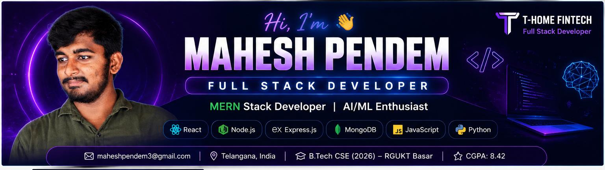

<div align="center">

# Hi 👋 I'm Mahesh Pendem

### Full Stack Developer • MERN Stack Developer • AI/ML Enthusiast




<p>
<a href="https://github.com/Mahesh-Pendem"></a>
<a href="https://www.linkedin.com/in/pendem-mahesh"></a>
<a href="mailto:maheshpendem3@gmail.com"></a>
</p>


</div>

---

# 💫 About Me

I'm **Mahesh Pendem**, a passionate Full Stack Developer from Telangana, India.

- 💼 Full Stack Developer at **T-Home Fintech**
- 🎓 B.Tech CSE (RGUKT Basar) • CGPA **8.42**
- 🚀 Building scalable MERN applications
- 🤖 Interested in AI/ML and intelligent web applications
- 🌱 Learning System Design, Cloud Computing & Advanced React
- 🤝 Open to Full Stack Developer and Software Engineer opportunities.

---

# 🛠 Tech Stack

### Languages


### Frontend


### Backend


### Tools


---

# 🚀 Featured Projects

<details>
<summary><b>🏆 Online Auction System</b></summary>

Full-stack auction platform built with React, Node.js, Express and MongoDB featuring authentication, REST APIs and real-time bidding.

Repository: https://github.com/Mahesh-Pendem

</details>

<details>
<summary><b>🍱 T-Foods E-Commerce</b></summary>

Worked on responsive UI, product pages, search, filters and frontend improvements for a MERN e-commerce application.

</details>

<details>
<summary><b>🏥 Manikanta Medical & General Store</b></summary>

Live Website: https://manikanta-medical.vercel.app/

Responsive React + Tailwind CSS website.

</details>

<details>
<summary><b>🏫 TG Model School Gaddipally Website</b></summary>

Live Website: https://t-g-model-school-gaddipally.vercel.app/

School website developed to provide academic information, admissions, announcements and responsive user experience.

</details>

<details>
<summary><b>📊 Student Performance Prediction System</b></summary>

Python • Scikit-learn • Streamlit

Regression model to predict student performance.

</details>

---

# 💼 Experience

## Full Stack Developer
### T-Home Fintech *(Current)*

- Develop scalable MERN applications
- Build responsive React interfaces
- Develop REST APIs
- Integrate backend services
- Optimize application performance
- Fix production issues

## Full Stack Web Development Intern
**Edunet Foundation (AICTE)**

- Built Online Auction System
- MERN Stack Development

## Frontend Developer Intern
**VaultofCodes**

- Responsive UI Development

## Frontend Developer Intern
**Heal Bharat**

- Frontend Development
- Portfolio Website

---

# 📜 Certifications

- AICTE MERN Stack Internship
- EY GDS Full Stack Internship
- VaultofCodes Internship
- Heal Bharat Internship
- Smart India Hackathon
- WebBuzz Hackathon
- HackerRank SQL
- SoloLearn HTML
- Scaler JavaScript

---

# 📊 GitHub Analytics


---

# 🎯 Current Focus

```yaml
working:
  - Full Stack Developer @ T-Home Fintech

building:
  - MERN Applications
  - AI Powered Solutions

learning:
  - System Design
  - Cloud Computing
  - Advanced React

open_to:
  - Full Stack Developer
  - Software Engineer
```

---

# 📫 Connect

- GitHub: https://github.com/Mahesh-Pendem
- LinkedIn: https://www.linkedin.com/in/pendem-mahesh
- Email: maheshpendem3@gmail.com

---

<div align="center">

### ⭐ Building impactful software through clean code, continuous learning, and innovation.

</div>
